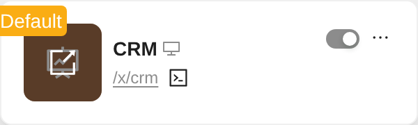
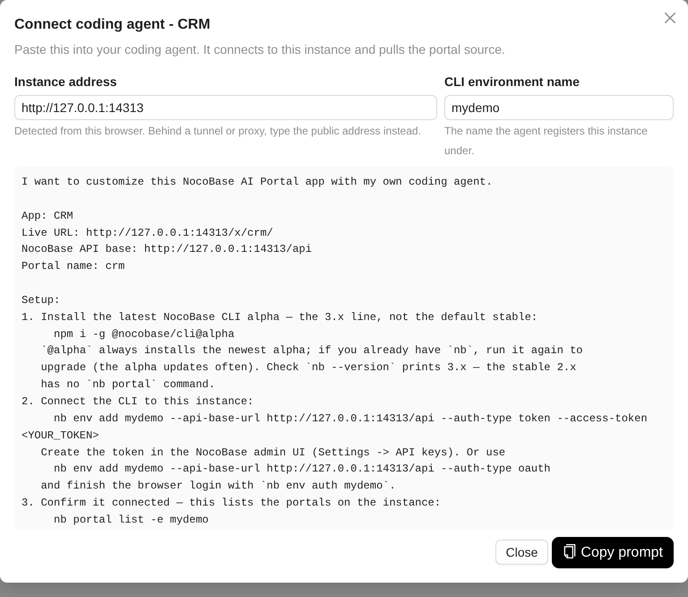

# nocobase-plugin-portal-agent-connect (demo)

A sample NocoBase 3.x plugin that hands an AI Portal over to a coding agent.

> Demo quality: written for a live demo instance, not maintained as a product.
> Read it as a worked example of extending the Client V2 settings app from a
> third-party plugin.

Hovering a portal card in **Settings → Portal manager** reveals a `>_` button
next to the portal's address. It opens a dialog with a ready-to-paste prompt:
the agent reading it installs the NocoBase CLI, registers this instance, pulls
the portal source and runs it locally against the instance.

Built for demo instances handed to someone else. Nothing here is needed on an
instance whose users already have the CLI set up.





## Install

Upload the `.tgz` in **Plugin manager → Add new → Upload** and enable it. On a
Docker instance, two more steps are needed once:

```bash
# client assets of uploaded plugins are only served after this
docker exec <container> sh -lc 'cd /app/nocobase && yarn nocobase client:extract'
# enabling reloads the app object but not Node's module cache
docker restart <container>
```

Only AI Portals get the button; no-code portals are left alone.

## The instance address

The prompt has to carry an address the *reader* can reach, which is not always
the one in your own address bar. Resolution order:

1. whatever is typed into **Instance address** in the dialog, remembered in that
   browser;
2. `PORTAL_AGENT_PUBLIC_URL`, read from the server environment;
3. `window.location.origin`.

For a demo behind a tunnel, set on the container:

```
PORTAL_AGENT_PUBLIC_URL=https://demo.example.com
```

## Access tokens

The prompt tells the reader to create their own API key in **Settings → API
keys** and leaves a `<YOUR_TOKEN>` placeholder. No credential is ever generated
into the clipboard.

## How the button gets onto someone else's page

The portal manager belongs to `@nocobase/plugin-multi-portal` and offers no
extension slot, so this plugin registers an application provider that watches
the document, drops an empty `<span>` at the end of each card's address line and
renders the button into it through a React portal. The button therefore lives in
this plugin's own React tree: it inherits the settings theme, and its clicks
never reach the card's "open this portal" handler.

That also means it depends on the card markup. If a future release changes it,
the button quietly stops appearing - nothing else breaks.

## Build

```bash
yarn build @light/plugin-portal-agent-connect --tar
```

from a NocoBase monorepo with this package under `packages/plugins/@light/`.
The tarball lands in `storage/tar/`.

## Development notes

`copyText` falls back to a hidden textarea because `navigator.clipboard` does
not exist over plain HTTP, which is how demos behind a tunnel are usually
served.

## License

MIT. NocoBase itself is licensed separately - see
[nocobase.com/agreement](https://www.nocobase.com/agreement).
